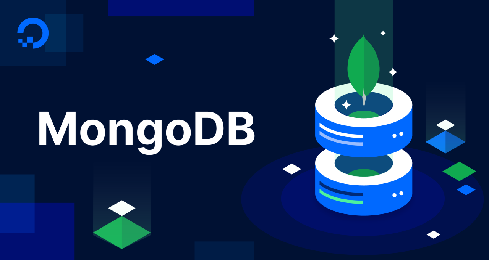

## 📘 interview-bank/backend/database.md

- <b>Author: `@Vinhdev04`</b>  
  

> 🧠 "Chuẩn bị phỏng vấn bài bản – Tự tin chiến thắng vòng Technical"

---

### ❓ Câu hỏi: "MongoDB là gì và tại sao lại sử dụng MongoDB?"

✅ Trả lời:
MongoDB là một cơ sở dữ liệu NoSQL, lưu trữ dữ liệu dưới dạng tài liệu JSON-like (BSON). MongoDB đặc biệt khi làm việc với dữ liệu phi cấu trúc và dữ liệu có tính linh hoạt cao. Nó hỗ trợ tính mở rộng ngang (horizontal scaling), điều này làm cho MongoDB rất hiệu quả trong các hệ thống cần xử lý dữ liệu lớn.

🔥 Độ khó: ★☆☆☆☆  
🏷️ Tags: #mongodb #database #nosql

---

### ❓ Câu hỏi: "Sự khác biệt giữa MongoDB và SQL?"

✅ Trả lời:

- **MongoDB (NoSQL)**: Lưu trữ dữ liệu dưới dạng tài liệu (document), không có schema cố định.
- **SQL (RDBMS)**: Lưu trữ dữ liệu trong bảng (table) với các trường cố định (schema), và quan hệ giữa các bảng.

🔥 Độ khó: ★★☆☆☆  
🏷️ Tags: #mongodb #sql #database

---

### ❓ Câu hỏi: "Tại sao MongoDB lại sử dụng BSON thay vì JSON?"

✅ Trả lời:
BSON (Binary JSON) là định dạng lưu trữ dữ liệu của MongoDB, giúp lưu trữ các loại dữ liệu không hỗ trợ trong JSON chuẩn như `Date`, `Binary` và `ObjectId`. BSON cũng được tối ưu hóa về hiệu suất khi xử lý dữ liệu lớn.

🔥 Độ khó: ★★☆☆☆  
🏷️ Tags: #mongodb #bson #nosql

---
