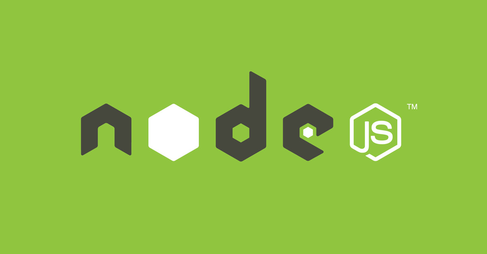

## 📘 interview-bank/backend/node.md

- <b>Author: `@Vinhdev04`</b>  
  

> 🧠 "Chuẩn bị phỏng vấn bài bản – Tự tin chiến thắng vòng Technical"

---

### ❓ Câu hỏi: "Node.js là gì và tại sao lại sử dụng Node.js?"

✅ Trả lời:
Node.js là môi trường runtime JavaScript bên ngoài trình duyệt, dựa trên V8 engine của Google Chrome. Nó cho phép sử dụng JavaScript để xây dựng server-side applications. Lý do chọn Node.js vì khả năng xử lý đồng thời các kết nối (asynchronous) và hiệu suất cao trong các ứng dụng I/O-heavy như chat, streaming.

🔥 Độ khó: ★☆☆☆☆  
🏷️ Tags: #nodejs #server #backend

---

### ❓ Câu hỏi: "Event loop trong Node.js hoạt động như thế nào?"

✅ Trả lời:
Event loop là cơ chế điều phối các task trong Node.js, giúp xử lý bất đồng bộ. Các loại task trong Node.js gồm:

1. **Timers**: setTimeout, setInterval
2. **I/O Callbacks**: các callback từ hệ thống file, HTTP request, database
3. **Idle, Prepare**: chuẩn bị xử lý I/O
4. **Poll**: kiểm tra các event chưa xử lý
5. **Check**: xử lý setImmediate
6. **Close**: các event đóng lại, như socket kết nối

🔥 Độ khó: ★★★☆☆  
🏷️ Tags: #nodejs #event-loop #asynchronous

---

### ❓ Câu hỏi: "Callback hell trong Node.js là gì và cách giải quyết?"

✅ Trả lời:
Callback hell là vấn đề khi nhiều callback lồng nhau, gây khó khăn trong việc duy trì và debug code. Để giải quyết, có thể sử dụng:

1. **Promises**: Cải thiện khả năng đọc code và xử lý bất đồng bộ
2. **Async/Await**: Giải pháp giúp code trông như đồng bộ nhưng thực tế là bất đồng bộ.

🔥 Độ khó: ★★★☆☆  
🏷️ Tags: #nodejs #callback #asynchronous

---
