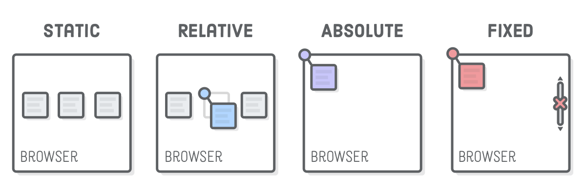

## 📘 interview-bank/frontend/html-css.md

- <b>Author: `@Vinhdev04`</b>  
  

> 🧠 "Chuẩn bị phỏng vấn bài bản – Tự tin chiến thắng vòng Technical"

---

## 💼 Giới thiệu Series

Series này tổng hợp những **câu hỏi thường gặp trong phỏng vấn IT**, kèm theo **phân tích và lời giải thích chi tiết**, giúp bạn:

- Ôn lại kiến thức nền tảng quan trọng
- Hiểu cách diễn đạt câu trả lời logic, ngắn gọn
- Tránh lỗi tâm lý/phát biểu sai khi phỏng vấn
- Làm quen với tình huống phỏng vấn thực tế

---

🔥 Độ khó: ★★☆☆☆  
🏷️ Tags: #database #nosql #design

---

### ❓ Câu hỏi: "Box model trong CSS là gì?"

✅ Trả lời:
Box model là cấu trúc hình hộp của một phần tử HTML trong CSS, bao gồm các lớp từ trong ra ngoài: `content` → `padding` → `border` → `margin`.

📝 Điều quan trọng là mỗi phần tử đều bị ảnh hưởng bởi box model khi tính kích thước hoặc margin/padding.

🔥 Độ khó: ★☆☆☆☆  
🏷️ Tags: #css #box-model #layout

---

### ❓ Câu hỏi: "Sự khác biệt giữa absolute, relative, fixed và sticky là gì?"

✅ Trả lời:

- `relative`: định vị so với vị trí ban đầu
- `absolute`: định vị so với phần tử cha gần nhất có position (không thì so với viewport)
- `fixed`: định vị cố định theo viewport
- `sticky`: chuyển từ relative sang fixed khi scroll đến một ngưỡng nhất định

🔥 Độ khó: ★★☆☆☆  
🏷️ Tags: #css #position #layout

---

### ❓ `Câu hỏi 01: Specificity trong CSS là gì?`

✅ Trả lời:
Specificity là mức độ ưu tiên của một selector khi áp dụng style. Thứ tự ưu tiên:

1. Inline style
2. ID selector
3. Class, pseudo-class, attribute
4. Element tag

Ví dụ: `#id > .class > tag` → specificity: 100 > 10 > 1

🔥 Độ khó: ★★☆☆☆  
🏷️ Tags: #css #specificity #selector

---

### ❓ `Câu hỏi 02: . Phân biệt những điểm khác nhau giữa Class selector và ID Selector trong CSS?`

✅ Trả lời:

- `ID Selector` dùng để khai báo cho một phần tử HTML duy nhất và không sử dụng lần nào nữa trên website.
- `CLASS Selector` dùng để khai báo cho nhiều phần tử có thể dùng chung một class. Có nghĩa là bạn có thể dùng một class nhiều lần trên website.
- `Mức độ ưu tiên`: ID cao hơn Class
- `Tính duy nhất`: Class Có thể áp dụng cho nhiều phần tử HTML,ID Chỉ nên áp dụng cho một phần tử duy nhất trên trang.
- `Tái sử dụng`: Class tái sử dụng cho nhiều phần tử, ID Không nên tái sử dụng, thường dùng cho định danh cụ thể

---

### ❓ `Câu hỏi 03: Phân biệt các phần tử relative, fixed, absolute và statically positioned element là gì?`

✅ Trả lời:

- `Static`: Đây được xem là giá trị hiển thị Position trong css một cách mặc định (default), các thành phần sẽ nằm theo thứ tự của văn bản.
  - Mặc định cho mọi phần tử HTML
  - Không bị ảnh hưởng bởi các thuộc tính như top, left, bottom, right
  - Vị trí phụ thuộc vào dòng luồng thông thường của tài liệu
  -
- `Relative`: Định vị trí tuyệt đối cho các thành phần, không gây ảnh hưởng tới vị trí ban đầu hay các thành phần khác.

  - Phần tử vẫn chiếm vị trí ban đầu trong flow
  - Nhưng có thể di chuyển tương đối so với chính nó bằng top, left, v.v.

- `Absolute`: Giá trị này sẽ giúp định vị trí tuyệt đối cho thành phần theo thành phần bao ngoài, hoặc ít nhất là theo cửa sổ trình duyệt. Fixed: Định vị trí tương đối cho thành phần theo cửa sổ trình duyệt.
  - Phần tử bị loại khỏi luồng bình thường
  - Vị trí được tính theo phần tử cha gần nhất có `position khác static`
  - Nếu không có phần tử cha định vị, `nó sẽ lấy theo body hoặc html`
- `Fixed`: Định vị và giúp cho phần tử luôn cố định một chỗ

  - Phần tử được gắn cố định vào cửa sổ trình duyệt
  - ví dụ như khi bạn scroll trình duyệt chẳng hạn, phần tử sẽ không thay đổi.
  - Di chuyển theo màn hình trình duyệt (viewport)

- `Inherit`: Xác định thừa hưởng thuộc tính từ thành phần cha (thành phần bao ngoài).

---

### ❓ `Câu hỏi 04: Phân biệt Display với Visibility?`

✅ Trả lời:

- <b>Thuộc tính: Display</b>
  - `Giá trị phổ biến`: none, block, inline, flex, v.v.
  - `Tác động hiển thị`: Ẩn phần tử hoàn toàn, không chiếm không gian trên layout
  - `Có render DOM không?`: Không (bị loại khỏi flow layout DOM)
  - `Tương tác (click, hover,...)`: Không thể (vì không tồn tại trên trang)
  - `Thường dùng khi...`: Muốn ẩn hoàn toàn khỏi layout (ví dụ: chuyển tab, toggle menu)
- <b>Thuộc tính: Visibility</b>
  - `Giá trị phổ biến`: visible, hidden, collapse
  - `Tác động hiển thị`: Ẩn phần tử về mặt hình ảnh, nhưng vẫn chiếm chỗ
  - `Có render DOM không?`: Có, vẫn trong flow layout
  - `Tương tác (click, hover,...)`: Không thấy nhưng vẫn tồn tại (có thể bị chặn tương tác bằng JS)
  - `Thường dùng khi...`: Muốn ẩn tạm thời nhưng vẫn giữ layout (ví dụ: tooltip, hiệu ứng chuyển cảnh)

---
