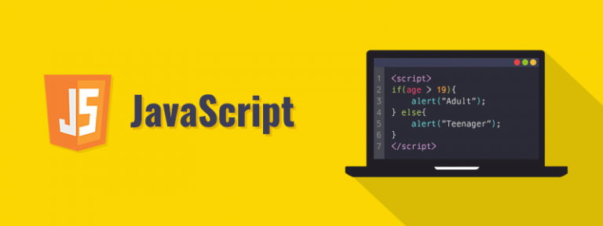

## 📘 interview-bank/frontend/javascript.md

- <b>Author: `@Vinhdev04`</b><br><br>
  

> 🧠 "Hiểu sâu JavaScript – Vượt qua mọi vòng phỏng vấn"

---

## 💼 Giới thiệu Series

Series này giúp bạn:

- Làm chủ nền tảng JavaScript từ cơ bản đến nâng cao
- Tránh các lỗi thường gặp và hiểu kỹ cơ chế hoạt động bên trong JS
- Có thể tự tin giải thích các khái niệm với nhà tuyển dụng

---

### ❓ Câu hỏi: "So sánh var, let và const trong JavaScript"

✅ Trả lời:

- `var`: khai báo biến toàn cục hoặc function scope, có thể bị hoisting
- `let`: block scope, không hoisting như var
- `const`: giống let nhưng không gán lại được

| Từ khóa | Scope    | Hoisting | Gán lại | Khởi tạo lại |
| ------- | -------- | -------- | ------- | ------------ |
| var     | function | Có       | Có      | Có           |
| let     | block    | Không    | Có      | Không        |
| const   | block    | Không    | Không   | Không        |

🔥 Độ khó: ★☆☆☆☆  
🏷️ Tags: #javascript #scope #variable

---

### ❓ Câu hỏi: "JavaScript closure là gì?"

✅ Trả lời:
Closure là function ghi nhớ được biến bên ngoài khi nó được tạo ra, ngay cả khi function đó được gọi ngoài phạm vi ban đầu.

Ví dụ:

```js
function outer() {
  let counter = 0;
  return function inner() {
    counter++;
    return counter;
  };
}
const count = outer();
console.log(count()); // 1
console.log(count()); // 2
```

📝 Closure giúp tạo private variable và các pattern như memoization, module pattern.  
🔥 Độ khó: ★★★☆☆  
🏷️ Tags: #closure #javascript #function

---

### ❓ Câu hỏi: "Sự khác nhau giữa == và === trong JS là gì?"

✅ Trả lời:

- `==`: so sánh bằng giá trị, có ép kiểu
- `===`: so sánh bằng cả giá trị và kiểu dữ liệu (strict equality)

```js
"5" == 5; // true
"5" === 5; // false
```

🔥 Độ khó: ★☆☆☆☆  
🏷️ Tags: #equality #type-coercion #javascript
